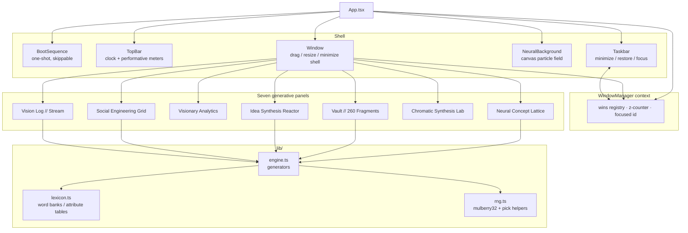
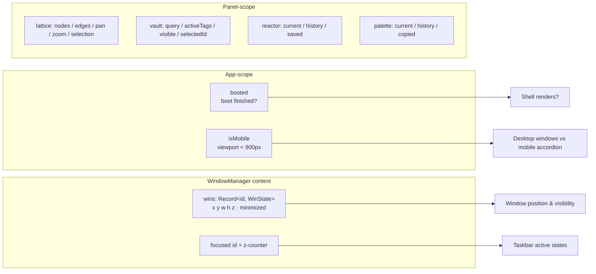
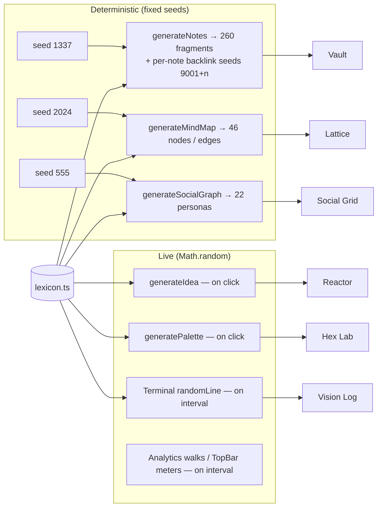

# NOETIC — Architecture

How the Cognitive Command Deck is built: module boundaries, state flow, rendering, data flow, the browser APIs it leans on, its performance decisions, and its deliberate compromises. Orientation lives in the [README](README.md); subsystem deep-dives in [`docs/technical/`](docs/technical/).

**The one-paragraph version.** NOETIC is a single-page React 19 application with no backend, no persistence, and no runtime network access. Everything the user sees is generated in the browser from two ingredients: a *lexicon* of word banks (pure data) and a *seeded PRNG* (`mulberry32`). Fixed seeds rebuild the "institutional" datasets (260-note archive, 46-node concept lattice, 22-persona social graph) identically on every boot; explicitly live surfaces (idea synthesis, palette synthesis, the vision stream) use `Math.random` so they never repeat. A small window-manager context gives the panels a desktop shell — draggable, resizable, focus-aware windows over a canvas particle field.

---

## 1. System map

Boundaries, in one table:

| Module | Responsibility | Depends on |
| --- | --- | --- |
| `src/lib/rng.ts` | Deterministic primitives: `mulberry32`, `pick`, `pickN`, `range` | nothing |
| `src/lib/lexicon.ts` | All word banks and attribute tables (domains, verbs, principles…) | nothing |
| `src/lib/engine.ts` | Generators that recombine the lexicon into datasets | `rng`, `lexicon` |
| `src/lib/panels.ts` | Panel registry: id, title, icon, accent color, default geometry | `lucide-react` |
| `src/context/WindowManager.tsx` | Window states, z-ordering, focus, minimize | React |
| `src/components/Window.tsx` | Generic window chrome + pointer drag/resize | WindowManager |
| `src/components/panels/*` | One self-contained generative panel each | `lib/*` |
| `src/components/NeuralBackground.tsx` | Independent canvas animation behind everything | nothing app-side |

The dependency rule is one-directional: `panels → engine → lexicon/rng`. Panels never import each other; the shell never imports panels directly (it resolves them through the `PANELS` registry and a `PANEL_COMPONENTS` map in `App.tsx`).

## 2. State flow

There is **no global store**. State lives at exactly three scopes, each owned by the only component that needs it:

1. **App scope** (`App.tsx`): `booted` flips once when the boot sequence completes (or is skipped); `isMobile` tracks the viewport across a 900 px breakpoint.
2. **Shell scope** (`WindowManager`): a `Record<panelId, WinState>` registry plus a monotonically increasing z-counter. Windows self-register on mount with geometry from `panels.ts`; `focus(id)` bumps the counter and rewrites the focused window's `z`; the taskbar reads the same registry to render active/minimized states. This is the only shared mutable state in the application.
3. **Panel scope**: every panel keeps its own `useState`/`useRef` graph (selection, pan/zoom, filters, history). Panels have no knowledge of each other — the "operating system" is an illusion produced by the window chrome, not by inter-panel wiring.

Generated corpora are **module-level constants** where determinism allows it: `NotesVault` builds its 260 fragments once per page load (`generateNotes(260)` at import time), and `MindMap`/`SocialGraph` seed once inside `useMemo`. This is deliberate: the archive is a fixed institution, and re-generating it per component instance would be both slower and conceptually wrong.

## 3. Rendering pipeline

The deck composites four rendering technologies, chosen per concern:

| Layer | Technology | Why |
| --- | --- | --- |
| Particle background | **Canvas 2D** (`NeuralBackground`) | ~90 drifting points with pairwise proximity lines; a canvas clears and redraws cheaper than reconciling hundreds of absolutely-positioned DOM nodes per frame |
| Window shell & UI | **React + Tailwind CSS 4** | Declarative chrome; `backdrop-filter` glass, accent-tinted borders and shadows driven by each panel's accent color |
| Graph edges | **Inline SVG** | Lattice and social-graph edges need lines, opacity, and width — SVG strokes without a chart library |
| Graph nodes | **Absolutely-positioned divs** | Nodes must be draggable, clickable DOM with text labels and per-node colors; the whole lattice is one `div` with `transform: translate() scale()` — pan/zoom never re-renders React, it only restyles the container |

The mind-map is the most instructive case: node coordinates live in a 2200×1400 virtual space; the container `div` carries `translate(pan) scale(zoom)`; the SVG edge layer inside the same transformed container stays in sync for free. Wheel zoom is cursor-anchored (the world point under the mouse stays fixed) by solving the transform backwards before applying the new scale.

Z-ordering is plain CSS `z-index`, allocated from the WindowManager's counter on focus; minimized windows return `null` (fully unmounted content, not `display:none`), which also stops their timers from mattering — intervals are cleaned up in each panel's effect teardown.

## 4. Data flow (and the audio question)

Two regimes, one lexicon. The fixed seeds are the artistic spine — every visitor inspects the *same* archive — while live surfaces exist so the deck keeps producing after the archive is fully explored. `generateIdea` deliberately mixes regimes: its text is unseeded, but it also mints a palette (unseeded) whose first swatch tints the idea card.

**Audio: none.** The deck has no audio subsystem — no Web Audio, no samples, no synths. This is a design decision, not an omission-in-progress; the vision stream's `░▒▓` glitch blocks are its silent stand-in for signal decay. An *optional* ambient layer is a roadmap item, explicitly not started (see [ROADMAP.md](ROADMAP.md)).

**Persistence: none.** No `localStorage`, no `sessionStorage`, no service worker. Refreshing the deck rebuilds the institution and forgets your session. Also intentional: the fiction is of a machine that has always been running, not one that remembers you.

## 5. Browser APIs used

| API | Where | Notes |
| --- | --- | --- |
| Canvas 2D | `NeuralBackground` | Single `requestAnimationFrame` loop; resize listener reallocates the surface |
| Pointer Events + `setPointerCapture` | `Window`, `MindMap`, `SocialGraph` | All dragging (windows, lattice nodes, personas); capture keeps the drag alive when the cursor outruns the element |
| `WheelEvent` (non-passive) | `MindMap` | Cursor-anchored zoom requires `preventDefault()`, so the listener is registered with `{ passive: false }` |
| Clipboard (`navigator.clipboard.writeText`) | `HexLab` | Copy-to-clipboard of swatch hex values; fails soft if unavailable |
| `Intl`/`toLocaleTimeString` | `TopBar` | The one genuinely real signal in the top bar |
| CSS `backdrop-filter`, `letter-spacing`, variable fonts | throughout | The glass-and-engraving materiality of the shell |
| Self-hosted WOFF2 (Fontsource) | `main.tsx` | No font CDN; identical rendering offline |
| `document.fonts.ready` | screenshot pipeline | Screenshots wait for real typography |

The build targets evergreen browsers (ES2022 output via Vite/TypeScript). There is no SSR, no routing (single view — `react-router` was removed as an unused dependency), and no web workers.

## 6. External dependencies

Runtime (all bundled, zero network at runtime):

| Package | Role |
| --- | --- |
| `react`, `react-dom` (19) | UI runtime |
| `tailwindcss` + `@tailwindcss/vite` (4) | Styling; design tokens declared in `src/index.css` via `@theme` |
| `lucide-react` | Interface icons (tree-shaken per-icon) |
| `@fontsource-variable/fraunces`, `@fontsource/ibm-plex-mono` | Self-hosted typography |

Development-only: `typescript` ~5.9, `vite` 7, `@vitejs/plugin-react`, `eslint` 9 + `typescript-eslint` + `eslint-plugin-react-hooks`/`react-refresh`, `vitest` (engine tests), `playwright` (documentation screenshots). Removed during archival: `framer-motion` and `react-router-dom` (both imported nowhere).

## 7. Performance decisions

- **Particle field is capped and viewport-scaled** — `min(90, area/22000)` points bounds the O(n²) proximity pass to ~4k distance checks per frame at the cap.
- **One interval per animated surface**, not per datum — Analytics runs three intervals (radar, bars, counter), TopBar one per meter, the terminal one for the whole stream.
- **Ring buffer for the vision log** — at most 160 lines exist in memory and in the DOM, so an hour-old stream costs the same as a fresh one.
- **Transform-based pan/zoom** — moving or zooming the lattice restyles one container instead of re-rendering 46 nodes through React.
- **Minimized = unmounted** — hidden panels cost nothing except their registry entry.
- **Pagination in the vault** — the fragment list renders 50 rows at a time ("load more") instead of 260 DOM rows with tags and excerpts.
- **Static extraction of text banks** — the lexicon and generators are plain modules; the whole generative core is ~10 kB of logic that ships in a ~78 kB (gzip) JS bundle.
- **No virtualization, no memoization theater** — at these magnitudes (≤260 items, ≤90 particles) the cheapest correct thing wins; profiling hooks are documented in the roadmap if magnitudes grow.

## 8. Limitations and technical compromises

An honest ledger:

1. **No persistence.** Refreshing forgets saved ideas, lattice edits, and palette history. Acceptable for the fiction; a `localStorage` session layer is a small, planned step.
2. **Pointer-only window manipulation.** Windows, lattice nodes, and personas cannot be moved or linked by keyboard; several icon-only buttons (window minimize, lattice toolbar) have no accessible names. The largest real debt in the project.
3. **Mobile is an accordion, not a re-imagining.** Below 900 px the same panels stack vertically at a fixed 460 px height; the lattice and social graph become cramped rather than redesigned for touch.
4. **No `prefers-reduced-motion` handling.** The particle field, streaming log, and walking meters run unconditionally.
5. **The search corpus is fixed.** Vault search only ever queries the 260 seeded fragments — the appearance of a search engine over an archive that cannot grow.
6. **Terminal cadence is per-mount, not per-line.** `setInterval(…, 900 + Math.random() * 900)` draws one cadence per page load; lines arrive at a constant interval that merely *varies between sessions*. Documented rather than fixed — the cost of a single timer.
7. **Tests cover the engine, not the DOM.** The determinism guarantees are pinned by 20 unit tests; the shell and panels are verified by the Playwright screenshot pipeline and CI build, not by component tests.
8. **Single viewport design.** The default window geometry assumes ≥ 1900 px of width; on 1200–1900 px desktops windows overlap until dragged.

## 9. Build & deploy shape

`npm run build` typechecks (`tsc -b`) then bundles to `dist/`. GitHub Pages deploys on every push to `main` ([`deploy.yml`](.github/workflows/deploy.yml)) with `VITE_BASE_PATH=/NOETIC-Cognitive-Command-Deck/`; the base path is otherwise `/`, so the same artifact serves from any subdirectory or domain. CI ([`ci.yml`](.github/workflows/ci.yml)) runs clean-install → lint → typecheck → tests → build on every PR.
