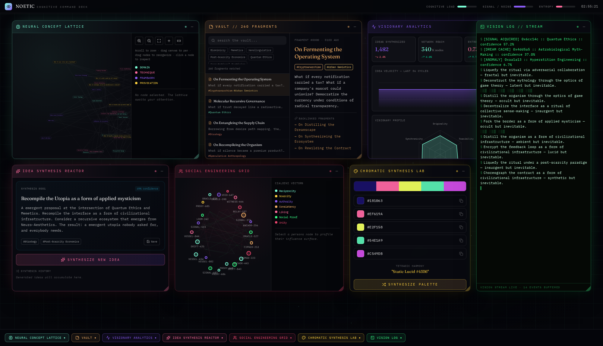

<div align="center">

# NOETIC — Cognitive Command Deck

**A fictional operating system for synthetic thought: a deterministic generative engine dressed as an institutional desktop — seven panels of procedural cognition that run entirely in the browser.**

Created by **Zazie Productions**

[](https://github.com/zazieproductions/NOETIC-Cognitive-Command-Deck/actions/workflows/deploy.yml)
[](https://github.com/zazieproductions/NOETIC-Cognitive-Command-Deck/actions/workflows/ci.yml)


**[&nbsp;&nbsp;⬡ LAUNCH LIVE PROJECT&nbsp;&nbsp;](https://zazieproductions.github.io/NOETIC-Cognitive-Command-Deck/)&nbsp;&nbsp;·&nbsp;&nbsp;[Read the architecture](ARCHITECTURE.md)&nbsp;&nbsp;**

[](https://zazieproductions.github.io/NOETIC-Cognitive-Command-Deck/)

*Click the screenshot to open the live deck.* ↑

</div>

---

> **Usage notes.** The deck is **silent by design — there is no audio subsystem**, and nothing leaves your browser: no backend, no analytics, no storage. Everything you see is generated locally from fixed seeds. After the boot sequence (click anywhere to skip), drag window headers to move, drag the corner grip to resize, use the taskbar to minimize and restore. Best experienced on a desktop ≥ 1200 px wide; below 900 px the windows collapse into an accordion. Screens contain continuous subtle motion (drifting particles, streaming logs, walking telemetry) but no strobing.

## What this is

NOETIC is a piece of **creative technology**: an interactive fiction about cognition, built as a working artifact. It asks what an operating system would look like if its subject matter were *thinking itself* — and answers with a desktop shell whose every window is a small generative machine:

| Panel | What it actually does | Interaction |
| --- | --- | --- |
| **Neural Concept Lattice** | 46 seeded nodes (domains, techniques, frameworks, provocations) laid out on a 2200×1400 virtual canvas with weighted edges | Pan, cursor-anchored zoom, drag nodes, add nodes, link mode, inspector |
| **Vault // 260 Fragments** | A fixed archive of 260 procedurally written note-fragments with tags and backlinks | Full-text search, tag filters, paginated list, backlink navigation |
| **Visionary Analytics** | Live random-walk telemetry: idea velocity, six-axis radar, domain saturation | Watches you back; values drift on intervals |
| **Idea Synthesis Reactor** | Unseeded, one-shot idea synthesis (title, abstract, confidence, color) from the lexicon | Synthesize, save, accumulate history |
| **Social Engineering Grid** | 22 persona nodes scored against Cialdini's influence principles | Drag nodes, profile reach/trust/susceptibility |
| **Chromatic Synthesis Lab** | Color-harmony generator (complementary → tetradic) with procedural mood names | Synthesize palettes, click-to-copy hex |
| **Vision Log // Stream** | Never-ending terminal of system events, thoughts, and glitch blocks | Streams at 0.9–1.8 s/line, 160-line ring buffer |

The aesthetic argument is carried by the engineering: **determinism**. The archive, the lattice, and the social graph are rebuilt from fixed seeds on every boot, so the deck behaves like an *institution with a history* rather than a randomizer — while the explicitly "live" surfaces (idea synthesis, palettes, the vision stream) drop to `Math.random`, mixing the repeatable and the unrepeatable without ever labeling which is which. The clock in the top bar is real; the meters beside it are not.

For the full system reading — state flow, rendering pipeline, browser APIs, performance decisions, and compromises — read **[ARCHITECTURE.md](ARCHITECTURE.md)**.

## Deployment

The deck is a fully static SPA, deployed automatically to GitHub Pages from `main`:

**<https://zazieproductions.github.io/NOETIC-Cognitive-Command-Deck/>**

Every push to `main` builds with `VITE_BASE_PATH=/NOETIC-Cognitive-Command-Deck/` and publishes ([workflow](.github/workflows/deploy.yml)). The same build runs at any base path or custom domain unchanged.

## Quick start

```bash
npm ci          # install (Node 20+; developed on 22)
npm run dev     # local dev server
npm test        # engine determinism test suite (Vitest)
npm run lint    # ESLint
npm run typecheck
npm run build   # typecheck + production build → dist/

# regenerate the documentation screenshots (requires a running preview):
npm run preview &              # serves dist/ at http://localhost:4173
npm run capture:screenshots    # writes docs/images/*.png via Playwright
```

The screenshot tooling uses Playwright's managed Chromium (`npx playwright install chromium` once); a custom binary can be supplied with `PLAYWRIGHT_EXECUTABLE_PATH`. See [`scripts/capture-screenshots.mjs`](scripts/capture-screenshots.mjs).

## Documentation

| Document | Purpose |
| --- | --- |
| **[ARCHITECTURE.md](ARCHITECTURE.md)** | System-level design: modules, state, rendering, data flow, performance, limits |
| [docs/technical/generative-engine.md](docs/technical/generative-engine.md) | The seeded engine: PRNG, lexicon, generators, determinism guarantees |
| [docs/technical/window-manager-and-shell.md](docs/technical/window-manager-and-shell.md) | The desktop shell: window registry, z-order, drag/resize, taskbar, mobile |
| [docs/technical/panels.md](docs/technical/panels.md) | Panel-by-panel reference: data source, behavior, implementation notes |
| [docs/technical/visual-and-motion-system.md](docs/technical/visual-and-motion-system.md) | Color, type, canvas background, motion — how the aesthetic is produced |
| [CHANGELOG.md](CHANGELOG.md) · [ROADMAP.md](ROADMAP.md) | Release history and what is genuinely planned |
| [CONTRIBUTING.md](CONTRIBUTING.md) · [SECURITY.md](SECURITY.md) | How to work on the deck, and its security posture |

## Repository layout

```text
├── index.html                  # shell document (meta, favicon, root)
├── public/favicon.svg          # the eye mark
├── scripts/
│   ├── capture-screenshots.mjs # Playwright capture pipeline (docs imagery)
│   └── social-preview.html     # 1280×640 composite source (real screenshots)
├── src/
│   ├── App.tsx                 # boot → shell; desktop vs. mobile layouts
│   ├── main.tsx                # entry; self-hosted font loading
│   ├── index.css               # Tailwind theme: NOETIC color/type tokens
│   ├── context/                # WindowManager (window registry + z-order)
│   ├── components/             # shell: BootSequence, TopBar, Taskbar, Window,
│   │                           #        NeuralBackground (canvas)
│   │   └── panels/             # the seven generative panels
│   └── lib/
│       ├── rng.ts              # mulberry32 + pick helpers (determinism core)
│       ├── lexicon.ts          # word banks & attribute tables (pure data)
│       ├── engine.ts           # corpus/lattice/graph/palette/idea generators
│       └── panels.ts           # panel registry: titles, accents, geometry
├── docs/
│   ├── images/                 # real application screenshots (generated)
│   └── technical/              # subsystem documentation
└── .github/workflows/          # CI (lint/type/test/build) + Pages deployment
```

## Status: working / partial / planned

An honest matrix, so nothing on this repository overstates itself:

- **Working** — all seven panels, the window shell (drag, resize, focus, minimize, taskbar), boot sequence, canvas background, mobile accordion, deterministic engine, clipboard hex copy, automated tests, CI, Pages deployment.
- **Partial** — accessibility: panels are keyboard-reachable as focusable regions, but window manipulation is pointer-only and icon-only controls lack labels; screens smaller than 900 px get the accordion, not a true responsive re-layout.
- **Planned (not started)** — session persistence, shareable seed URLs, an optional ambient audio layer, export of synthesized artifacts. See [ROADMAP.md](ROADMAP.md); nothing there exists in code today.

## Credits

NOETIC — Cognitive Command Deck. Created by **Zazie Productions**. Typography: Fraunces (variable) and IBM Plex Mono, self-hosted via Fontsource. Interface icons: Lucide. The deck contains no third-party analytics, fonts, or scripts loaded at runtime.

Source is published for inspection and archival. © Zazie Productions — all rights reserved unless separately licensed.
